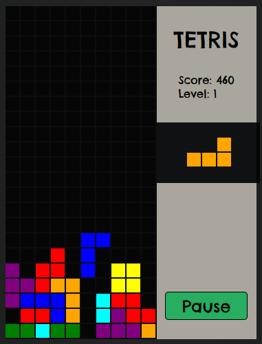

<h1>Game TETRIS Klasik</h1>
Jika anda anak tahun 2000 an , pasti tidak asing lagi dengan game ini, ini adalah game yang populer pada masanya . game ini bernama tetris
 
game ini dibangun hanya dengan menggunakan bahasa HTML dan CSS serta JS sebagai fungsional nya, game ini juga saat ini masih berjalan di platform web saja dengan perangkat yang bisa menggukannya masih terbatas di PC atau Laptop saja karena kontrolnya yang membutuhkan tombol yang ada dikeyboard sehingga untuk platform lain seperti HP masih belum memungkinkan

<h3>Kontrol Game</h3>
<ol>
  <li>Tombol Panah Atas , untuk merotate shape yang muncul</li>
  <li>Tombol Panah Bawah , untuk menurunkan shape yang muncul</li>
  <li>Tombol Panah Kiri , untuk Menggeser Kekiri shape yang muncul</li>
  <li>Tombol Panah Kanan , untuk Menggeser Kekanan shape yang muncul</li>
</ol>

<h3>Preview Game</h3>
 

